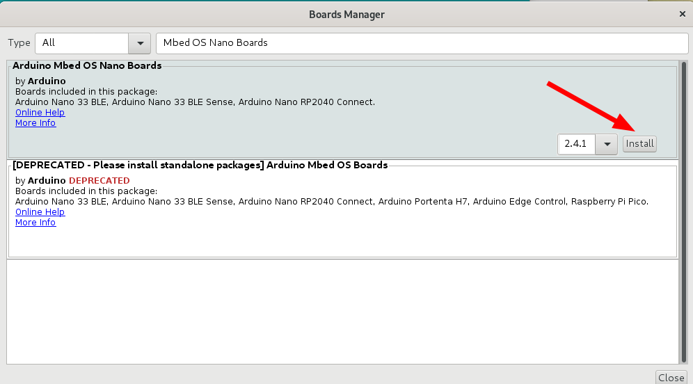
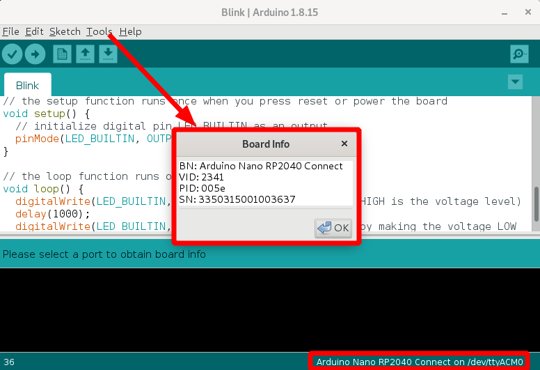
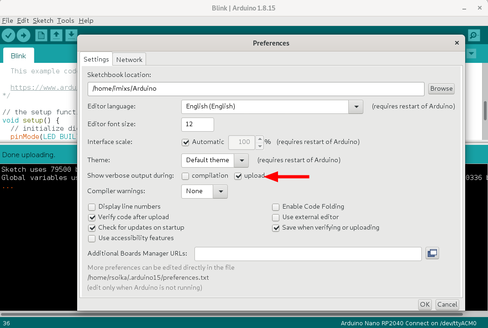

# Aruino

In the following section you will find some information how to setup a aruino controller with the aruino IDE and how to install the Imixs-IoT libraries on your aruino device.
The documentation we explain the setup based on the [aruino Nano RP2040](https://docs.arduino.cc/hardware/nano-rp2040-connect). The  RP2040 includes already a Wifi controller which makes it easy to connect the controller with a Imixs-Workflow Service. 

## Install the Aruino IDE

First of all you should install the official Aruino IDE. A step-by-step install guide for Linux can be found [here](https://www.arduino.cc/en/Guide/Linux). 

Download the  latest release from [here](https://www.arduino.cc/en/software) or find all releases on the [Github release page](https://github.com/arduino/Arduino/releases/). Extract the package in your preferred directory - e.g. /opt/aruino/ide/. In the following example we use the version 1.8.15. Replace the version number with the one you have downloaded:

	$ mkdir -p /opt/aruino/ide/
	$ tar -xf arduino-1.8.15-linux64.tar.xz -C /opt/aruino/ide/
	
Switch into the IDE directory and run the install script

	$ cd /opt/aruino/ide/arduino-1.8.15/
	$ sudo ./install.sh

In the install directory you will find the setup script 'arduino-linux-setup.sh'. This script will add your current user to the necessary groups (plugdev, dialout, tty, uucp) and setup your environment.

	$ ./arduino-linux-setup.sh
	
Now you can start the aruino IDE with:

	$ aruino	
	
	

	

## Installing Mbed OS Nano boards

A step-by-step guide to install the Nano RP2040 Connect board can be found [here](https://docs.arduino.cc/software/ide-v1/tutorials/getting-started/cores/arduino-mbed_nano).

First navigate to *Tools > Board > Board Manager*.

In this dialog you can search for your Ardono Board. For the [aruino Nano RP2040](https://docs.arduino.cc/hardware/nano-rp2040-connect) find the one named **Arduino Mbed OS Nano Boards** and install it.

Exit the board manager, and go to *Tools > Board > Arduino > Arduino Mbed OS Nano Boards*. Here you can see all the Mbed boards listed, where you can select the board you are using, e.g. :

	Tools > Board > Arduino > Arduino Mbed OS Nano Boards > aruino Nano RP2040 Connect

You can test the status of your board connected to your PC when you choose the menu item  *Tools > Get Board Info*. This will open a popup diaglog with the board details:

### Reconnect the Board

If you don't see your Board in the '*Board Info' dialog* or you can't see a connection in the menu section *Tools > Port* like "/dev/ttyACM..." than your board is not detected. In this case you can quickly press the hardware reset button on your Arduino Board. This will force the detection of new hardware device on you Linux OS. 

## Testing your Board

To test your board you can choose one of the examples provided in the Arduino IDE.

Navigate to *File > Examples > 01.Basics > Blink*.

Now you can click on the 'Upload' button to install and run the test program. You should see an output like this:

	Sketch uses 79500 bytes (0%) of program storage space. Maximum is 16777216 bytes.
	Global variables use 53324 bytes (19%) of dynamic memory, leaving 217012 bytes for local variables. Maximum is 270336 bytes.
	Forcing reset using 1200bps open/close on port /dev/ttyACM0
	~/.arduino15/packages/arduino/tools/rp2040tools/1.0.2/rp2040load -v -D /tmp/arduino_build_823381/Blink.ino.elf 
	rp2040load 1.0.1 - compiled with go1.15.8
	Loading into Flash: [==============================]  100%

To see the upload details you should set the preference option "*Show verbose output during  - upload*" 

After uploading the Sketch you Arduino Board should blink.

## Printing Output

You can print any log messages in your Sketch with a code like this:

	Serial.println("Hello World");

To see the output during execution open the *Serial Monitor* with Ctrl+Shift+M

# Known Issues

## Running Arduino IDE with sudo

In linux it may happen in rare cases that you run into a problem with USB connection if you do not run the Arduino IDE as sudo. If so, you can try to start Arduino with the sudo command:

	$ sudo arduino
    
## How to solve "Errors when uploading a sketch"?

If you are unable to upload a sketch to your Arduino device check [this site for possible solutions](https://support.arduino.cc/hc/en-us/articles/4403365313810)

Also it may help if you press the reset button on the Arduino board quickly 2 times when the board is connected with your notebook. 
See the discussion [here for details](https://forum.arduino.cc/t/aruino-nano-rp2040-on-board-led-no-longer-blinking-on-boot/899542). This simulates new hardware and will put the MKR on a new COM port.

## Nano RP2040 Connect not being detected on USB port 

In case your Nano RP2040 dose not connect and is not being detected on USB port you can follow this [guide](https://support.arduino.cc/hc/en-us/articles/4404168794514-Nano-RP2040-Connect-not-being-detected-on-USB-port).
