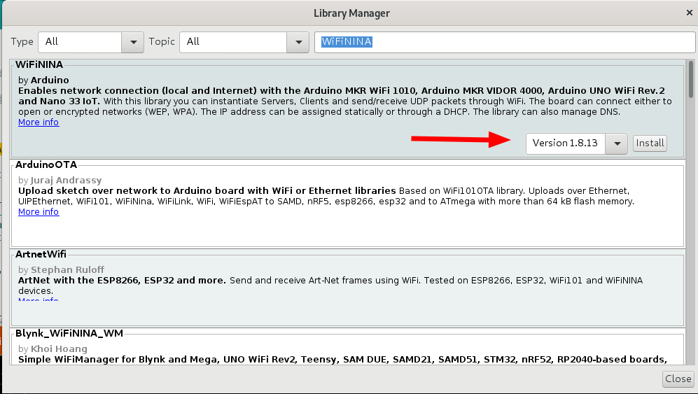

# Arduino WiFi Connection

The following section provides information about how to connect the [aruino Nano RP2040](https://docs.arduino.cc/hardware/nano-rp2040-connect) with a WiFi network.

Fist you need to install the Arduino Library 'WiFiNINA'

