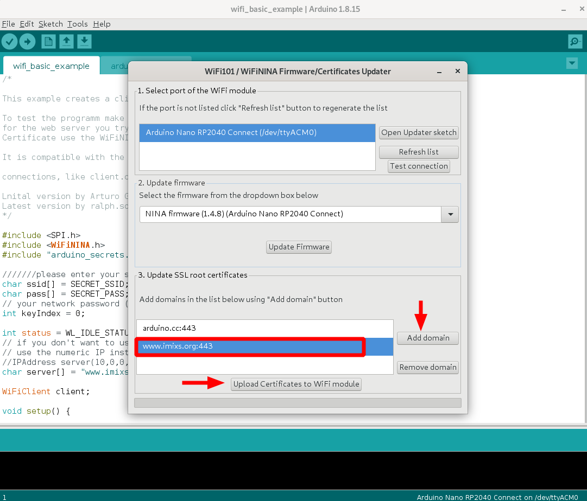

# Overview

In this section you will find example and test code  based on the *Nano RP2040 Connect* featuring a Wi-Fi module.

 - [Basic Example](./wifi_basic_example) - a basic wifi client example reading data from a HTTPS connection
 
**Note:** For all examples an test code you need to add the wifi library 'NINA'. Before you can compile and run the examples make sure that you have created the *arduino_secrets.h* file and also uploaded your servers root SSL certificates. Find details in the following section.

## Setup arduino_secrets.h

To run the examples first create a file named '*arduino_secrets.h*' and edit the WiFi SSID and your wifi password there. 

	#define SECRET_SSID "your_wifi_ssid"
	#define SECRET_PASS "your_wifi_password"

## Upload root SSL Certificates

To run teh example code make sure that you have uploaded the root SSL certificates
for the web server you try to connect to your Arduino nano. To upload a new 
Certificate use the WiFiNINA Firmware/Certificate Updater form Tools.

